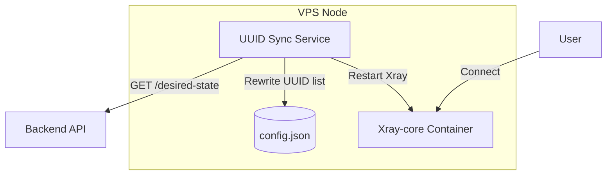

# 🚀 Atlas Node – MVP Implementation Plan

## 🎯 Goal

Create a reusable Docker-based VPN node that:

* Runs Xray-core
* Supports VLESS + Reality
* Syncs allowed UUIDs from backend (pull model)
* Reloads automatically on change
* Is deployable on any VPS

---

# 🧠 High-Level Architecture



---

# 📦 Project Structure

```
atlas-node/
├── docker-compose.yml
├── .env
├── xray/
│   ├── config.template.json
│   └── config.json (generated)
├── sync/
│   ├── Dockerfile
│   └── sync.py
└── README.md
```

---

# 🛠 Phase 1 — Static Xray Setup (Milestone 1)

## 🎯 Objective

Run Xray with ONE static UUID and connect successfully from client.

### Tasks

* [ ] Create docker-compose.yml with Xray container
* [ ] Add static config.json
* [ ] Open port 443 on VPS
* [ ] Start container
* [ ] Test connection from Happ client

### Success Criteria

✔ Client connects
✔ Internet works
✔ No sync logic yet

---

# 🔐 Phase 2 — Reality Configuration (Milestone 2)

## 🎯 Objective

Generate proper Reality keys and finalize production-ready inbound.

### Tasks

* [ ] Generate Reality keypair
* [ ] Add serverNames
* [ ] Add shortIds
* [ ] Validate connection still works

### Notes

Reality keys are **per-node static**.
UUIDs are dynamic.

---

# 🔄 Phase 3 — Sync Service (Pull Model) (Milestone 3)

## 🎯 Objective

Node automatically pulls allowed UUIDs from backend.

### Backend Contract (MVP)

```
GET /desired-state?node_id=sg-1
```

Response:

```json
[
  {"uuid": "uuid-1"},
  {"uuid": "uuid-2"}
]
```

---

## Sync Service Responsibilities

Every 30 seconds:

1. Fetch UUID list
2. Compare with current config
3. If changed:

   * Rewrite clients section
   * Restart Xray container

---

### Tasks

* [ ] Create sync container
* [ ] Mount config.json
* [ ] Implement polling loop
* [ ] Detect changes (hash compare)
* [ ] Restart xray on change

### Success Criteria

✔ Adding user in backend enables access
✔ Revoking user removes access

---

# 🧱 Phase 4 — Hardening (Milestone 4)

## Optional for MVP but Recommended

* [ ] Add health endpoint
* [ ] Add logging
* [ ] Add node_id validation
* [ ] Add simple auth token for backend calls
* [ ] Add rate limiting on inbound

---

# 🌍 Phase 5 — Multi-Node Deployment

## 🎯 Objective

Deploy same repo to multiple VPS.

### Tasks

* [ ] Parameterize node_id in .env
* [ ] Parameterize Reality keys
* [ ] Parameterize backend URL
* [ ] Deploy to second VPS
* [ ] Verify both nodes sync correctly

---

# 🔐 Environment Variables (.env)

Example:

```
NODE_ID=sg-1
BACKEND_URL=https://backend.yourdomain.com
SYNC_INTERVAL=30
REALITY_PRIVATE_KEY=xxx
REALITY_PUBLIC_KEY=xxx
SHORT_ID=abcd1234
```

---

# 🧪 Testing Checklist

### Manual Tests

* [ ] Static UUID works
* [ ] Sync adds new UUID
* [ ] Sync removes UUID
* [ ] Restart does not break traffic
* [ ] Node survives container restart

---

# 📌 Deployment Steps

On new VPS:

```
git clone atlas-node
cd atlas-node
cp .env.example .env
edit .env
docker compose up -d
```

Done.

---

# 🧠 Design Principles

* Xray = engine only
* Sync = control logic
* Backend = source of truth
* Node = stateless worker
* UUID list is dynamic
* Reality keys are static

---

# 🚦 MVP Completion Definition

MVP is complete when:

✔ One node deployed
✔ Backend issues UUID
✔ Node syncs automatically
✔ User connects successfully
✔ Revoke works